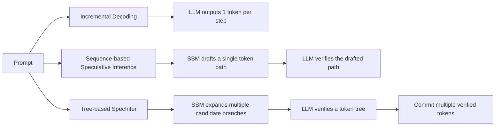
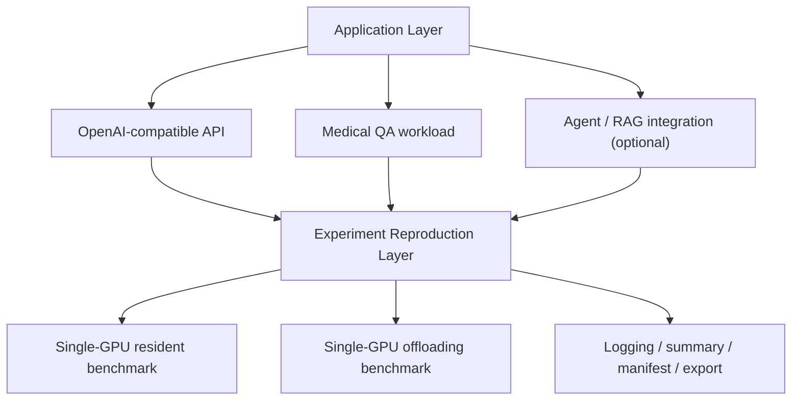
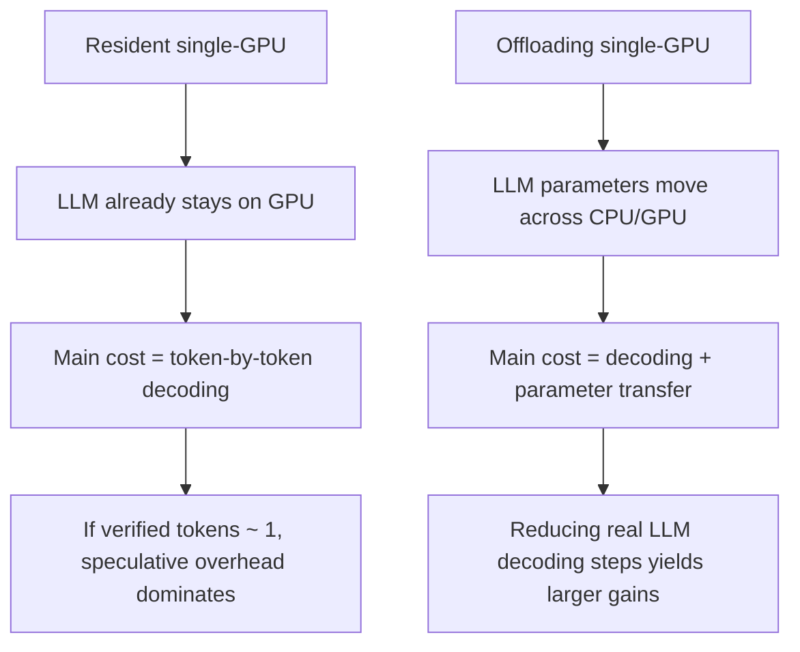

# 论文图表与示意图插入版

本文档用于配合 [论文初稿_完整整合版.md](/Users/Zhuanz/Documents/Typora/面经整理/面试/计算机/fresh/specinfer-ae/论文初稿_完整整合版.md) 使用。

目标有三件事：

1. 给出正文中各图表的**精确插入位置**
2. 直接提供可复制的 `图4-1 / 表5-1` 插入提示与图题/表题
3. 标出适合补充的**流程图、结构图、算法解释图**

---

## 一、正文图表总表

### 正文建议保留

| 编号 | 类型 | 建议标题 | 来源 |
|---|---|---|---|
| 图3-1 | 自绘结构图 | SpecInfer 三种推理模式示意图 | 自绘 |
| 图3-2 | 自绘系统图 | 本文实验与应用迁移总体框架 | 自绘 |
| 图3-3 | 自绘流程图 | 单卡复现实验流程图 | 自绘 |
| 表3-1 | 表格 | 实验环境与关键参数配置 | 手工整理 |
| 图4-1 | 图片 | 单卡常驻场景下三种推理模式的平均延迟对比 | [fig_4_1_resident_latency.png](/Users/Zhuanz/Documents/Typora/面经整理/面试/计算机/fresh/specinfer-ae/论文图表/fig_4_1_resident_latency.png) |
| 表4-1 | 表格 | 单卡常驻 benchmark 主要结果汇总 | [summary.csv](/Users/Zhuanz/Documents/Typora/面经整理/面试/计算机/fresh/specinfer-ae/final_review_20260316_035130/server_gpu_single_a100/summary.csv) |
| 图5-1 | 图片 | Offloading 场景 baseline 与 speculative 的 speedup 对比 | [fig_5_1_offloading_speedup.png](/Users/Zhuanz/Documents/Typora/面经整理/面试/计算机/fresh/specinfer-ae/论文图表/fig_5_1_offloading_speedup.png) |
| 图5-2 | 图片 | Offloading 场景 baseline 与 speculative 平均延迟对比 | [fig_5_2_offloading_latency.png](/Users/Zhuanz/Documents/Typora/面经整理/面试/计算机/fresh/specinfer-ae/论文图表/fig_5_2_offloading_latency.png) |
| 图5-3 | 图片 | Offloading speculative 路径的 verified token 分布 | [fig_5_3_offloading_verified_distribution.png](/Users/Zhuanz/Documents/Typora/面经整理/面试/计算机/fresh/specinfer-ae/论文图表/fig_5_3_offloading_verified_distribution.png) |
| 表5-1 | 表格 | 单卡 offloading baseline 与 speculative 对比结果 | [compare.csv](/Users/Zhuanz/Documents/Typora/面经整理/面试/计算机/fresh/specinfer-ae/final_review_20260316_035130/offloading/compare.csv) |
| 表5-2 | 表格 | Offloading verified token 统计结果 | [fig_5_3_offloading_verified_summary.csv](/Users/Zhuanz/Documents/Typora/面经整理/面试/计算机/fresh/specinfer-ae/论文图表/fig_5_3_offloading_verified_summary.csv) |
| 图6-1 | 图片 | 英文医疗问答工作负载稳定性分布 | [fig_6_1_english_stability.png](/Users/Zhuanz/Documents/Typora/面经整理/面试/计算机/fresh/specinfer-ae/论文图表/fig_6_1_english_stability.png) |
| 图6-2 | 图片 | 英文医疗问答输出一致性代理分布 | [fig_6_2_english_acceptance_proxy.png](/Users/Zhuanz/Documents/Typora/面经整理/面试/计算机/fresh/specinfer-ae/论文图表/fig_6_2_english_acceptance_proxy.png) |

### 附录建议保留

| 编号 | 类型 | 建议标题 | 来源 |
|---|---|---|---|
| 图A-1 | 图片 | 旧版 OPT-13B offloading 全量结果（bs=1/2/4/8/16） | [fig_app_1_legacy_opt13b_latency.png](/Users/Zhuanz/Documents/Typora/面经整理/面试/计算机/fresh/specinfer-ae/论文图表/fig_app_1_legacy_opt13b_latency.png) |
| 图A-2 | 图片 | 旧版 tree width 消融结果 | [fig_app_2_legacy_tree_width.png](/Users/Zhuanz/Documents/Typora/面经整理/面试/计算机/fresh/specinfer-ae/论文图表/fig_app_2_legacy_tree_width.png) |

---

## 二、逐章插入位置与可复制提示

## 第3章 系统设计与复现方法

### 3.1 节后插入：图3-1

插入位置：

- 放在 [论文初稿_完整整合版.md](/Users/Zhuanz/Documents/Typora/面经整理/面试/计算机/fresh/specinfer-ae/论文初稿_完整整合版.md) 的“**3.1 SpecInfer 机制概述**”最后一段之后。

可直接插入的提示文字：

```md
[图3-1 插入位置]
图3-1 SpecInfer 三种推理模式示意图
注：图中对比 incremental decoding、sequence-based speculative inference 与 tree-based speculative inference 的验证路径差异，并突出 verified token 对加速效果的决定作用。
```

### 3.2 节后插入：图3-2

插入位置：

- 放在“**3.2 总体系统结构**”末尾。

可直接插入的提示文字：

```md
[图3-2 插入位置]
图3-2 本文实验与应用迁移总体框架
注：上层为应用迁移层（OpenAI 兼容接口、医疗问答、Agent/RAG 接入），下层为实验复现层（模型下载、FlexFlow 构建、单卡常驻实验、offloading 实验、结果记录与导出）。
```

### 3.4 节后插入：图3-3

插入位置：

- 放在“**3.4 复现流程设计**”全部结束后，“**3.5 数据与 Prompt 设计**”之前。

可直接插入的提示文字：

```md
[图3-3 插入位置]
图3-3 单卡 SpecInfer 复现实验流程图
注：流程包含环境构建、模型准备、常驻实验、offloading 实验、日志汇总与结果导出等阶段。
```

### 3.6 节后插入：表3-1

插入位置：

- 放在“**3.6 实验记录与可复现性设计**”之后、“**3.7 本章小结**”之前。

可直接插入的提示文字：

```md
[表3-1 插入位置]
表3-1 实验环境与关键参数配置
字段建议：GPU 型号、CUDA 版本、FlexFlow/Legion 依赖、缓存根目录、常驻实验模型组合、offloading 实验模型组合、batch size、max sequence length、ZSIZE/FSIZE、日志与 manifest 记录方式。
```

## 第4章 单卡常驻场景实验与分析

### 4.2 节后插入：图4-1 与表4-1

插入位置：

- 放在“**4.2 单卡常驻 benchmark 结果**”第二段之后。

可直接插入的提示文字：

```md
[图4-1 插入位置]
图4-1 单卡常驻场景下三种推理模式的平均延迟对比
数据来源：final_review_20260316_035130/server_gpu_single_a100/summary.csv
对应图片：论文图表/fig_4_1_resident_latency.png
```

```md
[表4-1 插入位置]
表4-1 单卡常驻 benchmark 主要结果汇总
字段建议：batch size、mode、num_profiles、latency_mean_us、latency_p50_us、verified_mean。
数据来源：final_review_20260316_035130/server_gpu_single_a100/summary.csv
```

### 4.4 节后可选插入：图4-2（建议不用单独编号，若正文图过多可并入第6章）

如果你想在第4章也体现 `len64` 负结果，可以加：

```md
[图4-2 可选插入位置]
图4-2 英文 len64 工作负载下 baseline 与 speculative 的平均延迟对比
注：若正文篇幅紧张，此图建议并入第6章，不单独在第4章展示。
```

## 第5章 单卡 Offloading 场景实验与分析

### 5.2 节后插入：图5-1、图5-2、表5-1

插入位置：

- 放在“**5.2 baseline 与 speculative 的端到端对比**”结束后。

可直接插入的提示文字：

```md
[图5-1 插入位置]
图5-1 Offloading 场景下 baseline 与 speculative 的平均 speedup 对比
数据来源：final_review_20260316_035130/offloading/compare.csv
对应图片：论文图表/fig_5_1_offloading_speedup.png
```

```md
[图5-2 插入位置]
图5-2 Offloading 场景下 baseline 与 speculative 的平均延迟对比
数据来源：final_review_20260316_035130/offloading/compare.csv
对应图片：论文图表/fig_5_2_offloading_latency.png
```

```md
[表5-1 插入位置]
表5-1 单卡 offloading baseline 与 speculative 对比结果
字段建议：batch size、baseline_mean_us、baseline_p50_us、spec_mean_us、spec_p50_us、speedup_mean、speedup_p50。
数据来源：final_review_20260316_035130/offloading/compare.csv
```

### 5.3 节后插入：图5-3 与表5-2

插入位置：

- 放在“**5.3 机制解释：verified token 分布**”之后。

可直接插入的提示文字：

```md
[图5-3 插入位置]
图5-3 Offloading speculative 路径的 verified token 分布
数据来源：final_review_20260316_035130/offloading/spec_opt13b_r1/offloading_small_*.out
对应图片：论文图表/fig_5_3_offloading_verified_distribution.png
```

```md
[表5-2 插入位置]
表5-2 Offloading verified token 统计结果
字段建议：count、mean_verified_tokens、median_verified_tokens、max_verified_tokens、gt1_ratio。
数据来源：论文图表/fig_5_3_offloading_verified_summary.csv
```

### 5.4 节后可选插入：表5-3

这一节很适合再加一张“常驻 vs offloading”小对照表：

```md
[表5-3 可选插入位置]
表5-3 常驻单卡与 offloading 场景对照分析
字段建议：部署方式、目标模型、草稿模型、verified token 水平、是否观察到 speedup、主要系统瓶颈。
```

## 第6章 应用迁移：医疗问答与系统接入分析

### 6.2 节后插入：图6-1

插入位置：

- 放在“**6.2 英文医疗问答工作负载的稳定性**”之后。

可直接插入的提示文字：

```md
[图6-1 插入位置]
图6-1 英文医疗问答工作负载稳定性分布
数据来源：final_review_20260316_035130/english_len64/stability_summary_en/failure_summary.csv
对应图片：论文图表/fig_6_1_english_stability.png
```

### 6.3 节后插入：图6-2

插入位置：

- 放在“**6.3 输出一致性代理与应用层解释**”之后。

可直接插入的提示文字：

```md
[图6-2 插入位置]
图6-2 英文医疗问答输出一致性代理分布
数据来源：final_review_20260316_035130/english_len64/acceptance_analysis_en/acceptance_metrics.csv
对应图片：论文图表/fig_6_2_english_acceptance_proxy.png
```

### 6.4 节后可选插入：图6-3

如果你后面补了 FastAPI 或业务端截图，可以放：

```md
[图6-3 可选插入位置]
图6-3 OpenAI 兼容接口接入与业务端调用示意
注：若后续补齐接口截图、curl 响应或前端调用截图，可在此处放置。
```

## 第7章 复现难点、局限性与结论

### 7.1 节后可选插入：表7-1

```md
[表7-1 可选插入位置]
表7-1 SpecInfer 单卡复现中的主要问题与修复方法
字段建议：问题类别、具体现象、原因、修复方式、是否影响最终实验。
材料来源：问题回顾.md
```

---

## 三、建议补充的自绘图与算法解释图

这些图目前没有现成 PNG，但非常值得补。下面给出建议画法。

### 图3-1：SpecInfer 三种推理模式示意图

建议作用：

- 一张图讲清楚 `incr / sequence / tree`
- 是全文最值得补的解释图

建议内容：



### 图3-2：实验与应用迁移总体框架

建议作用：

- 把“主实验”和“应用迁移”分层写清

建议内容：



### 图3-3：单卡复现实验流程图

建议作用：

- 强调本文不是“只跑脚本”，而是有系统化复现过程

建议内容：


### 图5-4：为什么 offloading 比 resident 更容易受益

建议作用：

- 这是答辩时非常好用的解释图

建议内容：



---

## 四、历史数据如何使用

### 可以进附录或补充分析

1. [毕设实验结果/opt-13b 全量实验结果](/Users/Zhuanz/Documents/Typora/面经整理/面试/计算机/fresh/specinfer-ae/毕设实验结果/opt-13b%20全量实验结果)
   - 适合作为 `batch size = 8/16` 的补充结果
   - 适合支撑“offloading 路线在更大 batch 下仍有潜力”

2. [毕设实验结果/tree](/Users/Zhuanz/Documents/Typora/面经整理/面试/计算机/fresh/specinfer-ae/毕设实验结果/tree) 与 [毕设实验结果/tree_bs2](/Users/Zhuanz/Documents/Typora/面经整理/面试/计算机/fresh/specinfer-ae/毕设实验结果/tree_bs2)
   - 适合作为附录中的 tree width 消融
   - 当前看 `w=1` 比 `w=2` 更稳、更快

### 不建议进入正文主结论

1. [毕设实验结果/output](/Users/Zhuanz/Documents/Typora/面经整理/面试/计算机/fresh/specinfer-ae/毕设实验结果/output)
2. [毕设实验结果/round-1](/Users/Zhuanz/Documents/Typora/面经整理/面试/计算机/fresh/specinfer-ae/毕设实验结果/round-1)
3. [毕设实验结果/round-2](/Users/Zhuanz/Documents/Typora/面经整理/面试/计算机/fresh/specinfer-ae/毕设实验结果/round-2)

原因：

- 它们和当前 `final_review_20260316_035130` 的可复现实验存在冲突
- 缺少 manifest、commit 和统一参数快照
- 更适合作为“早期探索记录”，不适合承担正文主结论

---

## 五、推荐下一步

最建议你接下来做的，不是继续补实验，而是：

1. 把本文件中的插入提示复制到 [论文初稿_完整整合版.md](/Users/Zhuanz/Documents/Typora/面经整理/面试/计算机/fresh/specinfer-ae/论文初稿_完整整合版.md) 对应位置
2. 选择 1 到 2 张 mermaid 自绘图，导出或临摹成正式论文图
3. 开始做最终排版版稿件

